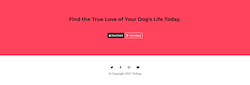

# TinDog - Completed Project
>"TinDog" was a project provided in HTML by The App Brewery's "The Complete Web Development Bootcamp".

## General Information
The purpose of this project was to understand and apply CSS, bootstrap, refactoring code, and learning how to use docs. 
I completed this project by looking at the finish project.
This project helped me understand Bootstrap CDN, the grid system, and the application of bootstrap components.

## Screenshots

## Technologies
* HTML5
* CSS3
* Bootstrap 4

## Status
Currently, this project is complete; however, there is always room for improvement and will come back to apply new methods I have learned. 

## Inspiration
Project provided by The App Brewery's "The Complete Web Development Bootcamp".

## Contact
Created by me. Please let me know if you have any questions. 

